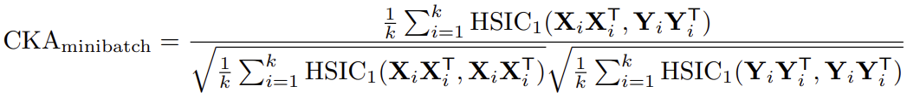
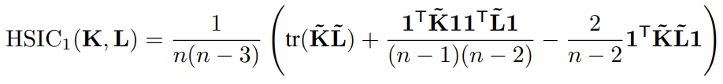
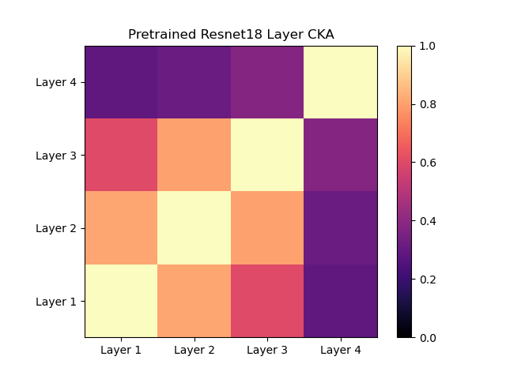

# CKA_minibatch_pytorch

Pytorch implementation of Centered Kernel Alignment (CKA) and its minibatch version.





## Example

A simple example comparing layer outputs of resnet18 can be found in `example.py`.




## Get Started

**Linear CKA**

```python
from cka import cka_score

# compute cka with features
cka_score = cka_score(x1, x2) 

# compute cka with gram matrix
g1 = x1 @ x1.transpose(0,1)
g2 = x2 @ x2.transpose(0,1)
cka_score = cka_score(g1, g2, gram=True)
```

**Minibatch CKA**

```python
from cka import CKA_Minibatch 

cka_logger = CKA_Minibatch()
for data_batch in data_loader:
    x1 = model_1(data_batch)
    x2 = model_2(data_batch)
    cka_logger.update(x1, x2)
# aggregate multiple splits to get more accurate estimation
cka_score = cka_logger.compute()
```

**Grid of Minibatch CKA**

```python
from cka import CKA_Minibatch_Grid

cka_logger = CKA_Minibatch_Grid(d1, d2)
for data_batch in data_loader:
    feature_list_1 = model_1(data_batch)  # len(feature_list_1) = d1
    feature_list_2 = model_2(data_batch)  # len(feature_list_2) = d2
    cka_logger.update(feature_list_1, feature_list_2)
cka_score_grid = cka_logger.compute() # [d1, d2]
```


## Reference

[1] Kornblith, Simon, et al. "Similarity of neural network representations revisited." *International Conference on Machine Learning*. PMLR, 2019.

[2] Nguyen, Thao, Maithra Raghu, and Simon Kornblith. "Do wide and deep networks learn the same things? uncovering how neural network representations vary with width and depth." *arXiv preprint arXiv:2010.15327* (2020).
